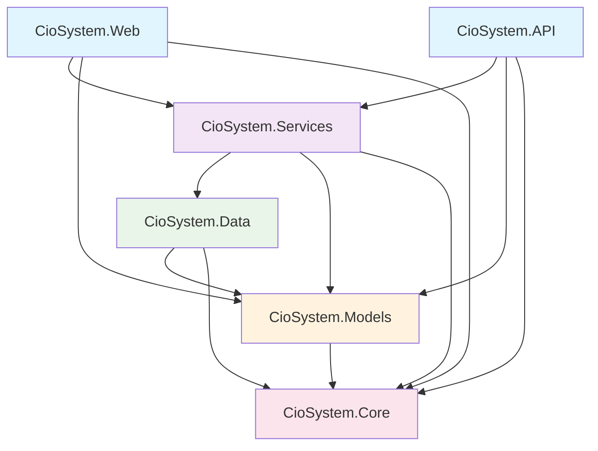

# CioSystem v1 (C#) 專案結構圖

## 整體架構

```
┌─────────────────────────────────────────────────────────────┐
│                    CioSystem v1 (C#)                        │
│                    學習建構模式專案                           │
└─────────────────────────────────────────────────────────────┘
                              │
                              ▼
┌─────────────────────────────────────────────────────────────┐
│                    解決方案層                                │
│                   (CioSystem.sln)                           │
└─────────────────────────────────────────────────────────────┘
                              │
                              ▼
        ┌─────────────────────────────────────────────────────┐
        │                   專案層                              │
        └─────────────────────────────────────────────────────┘
                              │
        ┌─────────────────────┼─────────────────────┐
        ▼                     ▼                     ▼
┌─────────────┐    ┌─────────────┐    ┌─────────────┐
│  展示層     │    │  應用層     │    │  領域層     │
│Presentation │    │Application  │    │   Domain    │
└─────────────┘    └─────────────┘    └─────────────┘
        │                     │                     │
        ▼                     ▼                     ▼
┌─────────────┐    ┌─────────────┐    ┌─────────────┐
│ CioSystem   │    │ CioSystem   │    │ CioSystem   │
│    .Web     │    │  .Services  │    │   .Core     │
│   (MVC)     │    │ (Business)  │    │(Interfaces) │
└─────────────┘    └─────────────┘    └─────────────┘
        │                     │                     │
        ▼                     ▼                     ▼
┌─────────────┐    ┌─────────────┐    ┌─────────────┐
│ CioSystem   │    │ CioSystem   │    │ CioSystem   │
│    .API     │    │   .Data     │    │  .Models    │
│  (Web API)  │    │(Repository) │    │(Entities)   │
└─────────────┘    └─────────────┘    └─────────────┘
```

## 專案依賴關係



## 各層職責詳解

### 1. 展示層 (Presentation Layer)

#### CioSystem.Web (MVC Web 應用程式)
- **職責**: 處理 HTTP 請求和回應，提供使用者介面
- **包含**: Controllers, Views, ViewModels
- **依賴**: Services, Models, Core

#### CioSystem.API (Web API)
- **職責**: 提供 RESTful API 端點
- **包含**: API Controllers, DTOs
- **依賴**: Services, Models, Core

### 2. 應用層 (Application Layer)

#### CioSystem.Services (業務邏輯服務)
- **職責**: 協調業務流程，處理應用程式邏輯
- **包含**: Service classes, Business rules, Validation
- **依賴**: Data, Models, Core

### 3. 領域層 (Domain Layer)

#### CioSystem.Core (核心介面)
- **職責**: 定義核心抽象和介面
- **包含**: IRepository, IUnitOfWork, BaseEntity
- **依賴**: 無（最底層）

#### CioSystem.Models (實體模型)
- **職責**: 定義業務實體和資料模型
- **包含**: Entity classes, Enums, Value objects
- **依賴**: Core

### 4. 基礎設施層 (Infrastructure Layer)

#### CioSystem.Data (資料存取)
- **職責**: 實作資料存取邏輯
- **包含**: Repository implementations, DbContext, Migrations
- **依賴**: Models, Core

## 檔案結構

```
CioSystem_v1(C#)/
├── README.md                    # 專案說明
├── 架構學習指南.md              # 詳細學習指南
├── 學習進度.md                  # 學習進度追蹤
├── 專案結構圖.md                # 本檔案
├── build.sh                     # 建置腳本
├── CioSystem.sln               # 解決方案檔案
├── CioSystem.Core/             # 核心層
│   ├── BaseEntity.cs           # 基礎實體類別
│   ├── IRepository.cs          # 儲存庫介面
│   └── IUnitOfWork.cs          # 工作單元介面
├── CioSystem.Models/           # 模型層
│   ├── Product.cs              # 產品實體
│   └── Inventory.cs            # 庫存實體
├── CioSystem.Data/             # 資料層
│   ├── CioSystemDbContext.cs   # 資料庫上下文
│   ├── Repositories/           # 儲存庫實作
│   └── Migrations/             # 資料庫遷移
├── CioSystem.Services/         # 服務層
│   ├── ProductService.cs       # 產品服務
│   └── InventoryService.cs     # 庫存服務
├── CioSystem.API/              # API 層
│   ├── Controllers/            # API 控制器
│   └── DTOs/                   # 資料傳輸物件
└── CioSystem.Web/              # Web 層
    ├── Controllers/            # MVC 控制器
    ├── Views/                  # Razor 視圖
    └── Models/                 # 視圖模型
```

## 設計模式應用

### 1. Repository Pattern
- **位置**: `CioSystem.Core/IRepository.cs`
- **實作**: `CioSystem.Data/Repositories/`
- **用途**: 抽象化資料存取邏輯

### 2. Unit of Work Pattern
- **位置**: `CioSystem.Core/IUnitOfWork.cs`
- **實作**: `CioSystem.Data/UnitOfWork.cs`
- **用途**: 管理資料庫交易和儲存庫

### 3. Dependency Injection
- **配置**: 各專案的 `Program.cs` 或 `Startup.cs`
- **用途**: 鬆耦合設計，便於測試

### 4. Base Entity Pattern
- **位置**: `CioSystem.Core/BaseEntity.cs`
- **用途**: 統一實體基礎屬性

## 學習路徑建議

### 第一階段：理解架構
1. 閱讀本檔案了解整體結構
2. 查看 `BaseEntity.cs` 理解基礎設計
3. 研究 `IRepository.cs` 和 `IUnitOfWork.cs`x  

### 第二階段：模型設計
1. 分析 `Product.cs` 實體設計
2. 研究 `Inventory.cs` 庫存模型
3. 理解實體關係和導航屬性

### 第三階段：資料存取
1. 實作 Repository 模式
2. 建立 DbContext
3. 學習 Entity Framework Core

### 第四階段：業務邏輯
1. 實作 Service 層
2. 添加業務規則驗證
3. 實作異常處理
    
### 第五階段：API 設計
1. 建立 API 控制器
2. 設計 DTO 類別
3. 實作 API 文件

### 第六階段：使用者介面
1. 建立 MVC 控制器
2. 設計 Razor 視圖
3. 實作前端互動

## 最佳實踐

### 1. 命名規範
- 介面以 `I` 開頭 (如 `IRepository`)
- 實體類別使用單數名詞 (如 `Product`)
- 服務類別以 `Service` 結尾 (如 `ProductService`)

### 2. 資料夾組織
- 按功能分組檔案
- 使用命名空間對應資料夾結構
- 保持清晰的依賴關係

### 3. 程式碼品質
- 添加詳細的 XML 註解
- 遵循 SOLID 原則
- 實作適當的錯誤處理

## 下一步學習

1. **實作資料存取層**: 學習 Entity Framework Core
2. **建立服務層**: 封裝業務邏輯
3. **設計 API**: 實作 RESTful 服務
4. **建立 Web 介面**: 實作使用者互動
5. **添加測試**: 撰寫單元測試和整合測試

記住：這是一個學習專案，重點是理解架構設計原理和最佳實踐。透過逐步實作，您將建立堅實的 .NET 開發基礎。